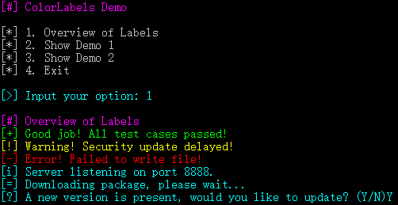
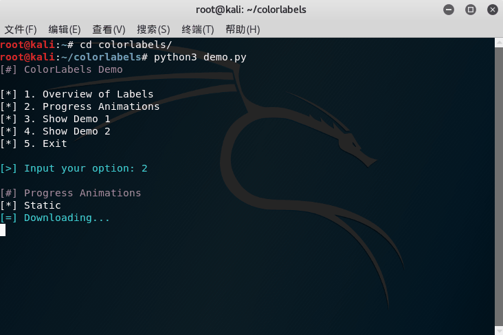

# colorlabels

[](http://pepy.tech/count/colorlabels)
[](https://pypi.org/project/colorlabels)
[](https://pypi.org/project/colorlabels)
[](https://pypi.org/project/colorlabels)
[](https://pypi.org/project/colorlabels)


`colorlabels` is a console message display library for Python. Equipped with various kinds of colorful and semantic labels, it is tailored for message display and interaction in automated scripts (e.g. test scripts, installation scripts and hacker tools).

## Demo

<p><div align="center"></div></p>
<p><div align="center"></div></p>

```python
import time
import colorlabels as cl

cl.section('Overview of Labels')
cl.success('Good job! All test cases passed!')
cl.warning('Warning! Security update delayed!')
cl.error('Error! Failed to write file!')
cl.info('Server listening on port 8888.')
cl.progress('Downloading package, please wait...')
cl.plain('Nothing interesting.')
choice = cl.question('A new version is present, would you like to update? (Y/N)')

with cl.progress('Downloading...', mode=cl.PROGRESS_SPIN):
    time.sleep(3)

with cl.progress('Downloading ', mode=cl.PROGRESS_DETERMINATE) as p:
    time.sleep(1)
    p.update(0.5, ' 50% (2.5MB/5MB) ETA 1s')
    time.sleep(1)
    p.update(1, ' 100% (5MB/5MB)')
```

## Features

- Various kinds of labels and progress animations. Colorful and semantic.
- Easy to use.
- Customizable.
- Compatible.
  - Works on Unix-like Systems & Windows. (Based on [colorama](https://github.com/tartley/colorama))
  - Works on both Python 2 & 3.

## Installation

```
pip install colorlabels
```

## Documentation

Coming soon...
