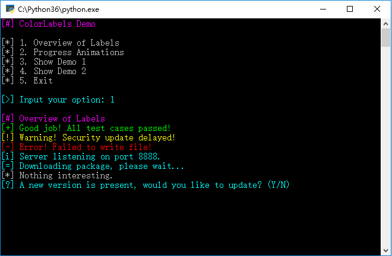

# colorlabels

## Demo




```python
import colorlabels as cl

cl.section('Overview of Labels')
cl.success('Good job! All test cases passed!')
cl.warning('Warning! Security update delayed!')
cl.error('Error! Failed to write file!')
cl.info('Server listening on port 8888.')
cl.progress('Downloading package, please wait...')
cl.plain('Nothing interesting.')
choice = cl.question('A new version is present, would you like to update? (Y/N)')

with cl.progress('Downloading...', mode=cl.PROGRESS_SPIN):
    time.sleep(3)

with cl.progress('Downloading ', mode=cl.PROGRESS_DETERMINATE) as p:
    time.sleep(1)
    p.update(0.5, ' 50% (2.5MB/5MB) ETA 1s')
    time.sleep(1)
    p.update(1, ' 100% (5MB/5MB)')
```

## Features

- Provides semantic and colorful labels in console. (Inspired by [@UltimateHackers](https://github.com/UltimateHackers))
- Designed for message display and interaction in automated scripts (e.g. test scripts, installation scripts and hacker tools).
- Various kinds of progress animations.
- Easy to use.
- Customizable.
- Compatible. (Based on [colorama](https://github.com/tartley/colorama))
  - Windows & Unix-like Systems
  - Python 2 & 3

## Installation

```
pip install colorlabels
```

## Documentation

Coming soon...
